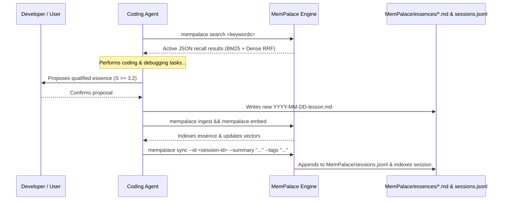

# How to Set Up MemPalace in a New Project

This guide provides the canonical, step-by-step workflow for integrating MemPalace into any existing or new project, configuring coding agents, automating environment bootstrapping, and verifying memory health.

---

## 1. Quick Start: 60-Second Setup

You can initialize MemPalace in any target project repository using one of three installation methods:

```bash
# Option 1: Zero-install one-liner via uvx (Fastest)
uvx --from git+https://github.com/aruruka/mempalace.git mempalace init-workspace

# Option 2: Standalone CLI tool installed in your environment (Recommended)
uv tool install git+https://github.com/aruruka/mempalace.git
mempalace init-workspace

# Option 3: Project dev dependency (for UV-managed Python projects)
uv add --dev "mempalace @ git+https://github.com/aruruka/mempalace.git"
uv run mempalace init-workspace
```

> **CLI Alias**: `mempalace setup` is a direct alias for `mempalace init-workspace`.

---

## 2. What the Initializer Does

When running `mempalace init-workspace`, the interactive wizard (or `--agent` non-interactive mode) executes the following operations:

```
Target Repository
├── MemPalace/
│   ├── essences/
│   │   ├── README.md                        # Essence qualification rubric & rules
│   │   └── YYYY-MM-DD-welcome-to-mempalace.md # Initial starter essence
│   ├── sessions.jsonl                       # Durable episodic session log (created on sync)
│   └── memory.sqlite                        # Pre-indexed SQLite database + embeddings
├── docs/decisions/
│   ├── README.md                            # ADR index & status lifecycle rules
│   └── template.md                          # ADR template with bidirectional supersession
├── scripts/
│   ├── setup-mempalace.ps1                  # Windows automated environment setup
│   └── setup-mempalace.sh                   # POSIX/macOS/Linux automated setup
├── .agents/skills/
│   ├── memory-sync/SKILL.md                 # 4-Entity proposal-first memory & session sync skill
│   └── decision-making/SKILL.md             # ADR lifecycle & governance skill
├── AGENTS.md / CLAUDE.md / .cursorrules     # Agent operating instructions & protocol
└── MEMPALACE_KICKOFF.md                     # Ready-to-copy agent activation prompt
```

1. **Scaffolding**: Creates `MemPalace/essences/` and `docs/decisions/` with starter templates and deterministic qualification rules.
2. **Database & Embeddings**: Creates `MemPalace/memory.sqlite`, initialises FTS5 schema across all 4 entities (`wisdom`, `decision`, `session`, `tool`), indexes starter records, and pre-computes dense vector embeddings so hybrid search works immediately.
3. **Agent Integration**: Installs agent configuration tailored to your target agent:
   - **OpenCode** / **Hermes** / **Antigravity** / **Gemini** / **Claude Code** / **Cursor** / **Generic**.
   - Installs `.agents/skills/memory-sync/SKILL.md` and `.agents/skills/decision-making/SKILL.md`.
4. **Automated Setup Scripts**: Generates `scripts/setup-mempalace.ps1` (PowerShell) and `scripts/setup-mempalace.sh` (Bash) to ensure zero-friction setup for team members and CI runners.
5. **Kick-Off Prompt**: Synthesizes `MEMPALACE_KICKOFF.md` containing clear activation instructions and self-healing environment bootstrap guidance for the agent.

---

## 3. Activating Your Coding Agent

Once `mempalace init-workspace` completes:

1. Open `MEMPALACE_KICKOFF.md` (or copy the output printed directly in the terminal).
2. Paste the prompt into your coding agent's session chat.
3. The agent will:
   - Run `mempalace doctor` to verify environment prerequisites and SQLite memory connectivity.
   - Run `mempalace search` / `mempalace list` to recall project conventions and lessons.
   - Adopt the **Unified 4-Entity Memory Protocol** (proposing qualified essences, recording ADRs, logging episodic sessions via `mempalace sync`, and registering reusable tools via `mempalace register-tools`).

---

## 4. Cross-Platform Team & CI Bootstrapping

To set up new machines, team members, or CI environments without manual intervention, run the generated setup script:

### Windows (PowerShell)
```powershell
.\scripts\setup-mempalace.ps1
```

### Linux / macOS (Bash)
```bash
chmod +x ./scripts/setup-mempalace.sh
./scripts/setup-mempalace.sh
```

These scripts automatically:
- Check for `uv` and install it if missing.
- Install or refresh the standalone `mempalace` CLI tool.
- Run `mempalace doctor` to validate health.
- Re-index and embed memory files via `mempalace ingest && mempalace embed`.

---

## 5. Health Verification with `mempalace doctor`

To diagnose the environment and verify database health at any time:

```bash
mempalace doctor
```

The diagnostic tool checks:
- **System Prerequisites**: Python runtime version ($\ge 3.13$), `uv` package manager installation.
- **CLI Availability**: Whether `mempalace` is directly in `PATH` or accessible via `uvx`/`uv run`.
- **Database & Storage**: Existence of `MemPalace/memory.sqlite`, write permissions, schema integrity, vector embedding coverage, and stale/archived entity count (`stale_count`, warning when $\ge 20$).
- **Essence Files**: Valid essence count, drift check vs database rows.
- **Agent Artifacts**: Verification of agent rules files (`AGENTS.md` / `CLAUDE.md`) and the `memory-sync` skill.

---

## 6. Daily 4-Entity Memory Workflow

In a project utilizing MemPalace, the routine interaction pattern across essences and sessions is:



### Useful Commands in Consumer Workspaces

- **List memories**: `mempalace list` (or `mempalace ls`)
- **Search active memory**: `mempalace search <query>` (or `--source tool <query>`)
- **Search including archived/superseded**: `mempalace search --include-archived <query>`
- **Ingest essences, ADRs, sessions.jsonl, and tools**: `mempalace ingest`
- **Log an episodic session**: `mempalace sync --id <session-id> --summary "<summary>" --tags "<tags>"`
- **Register ADRs / tools**: `mempalace register-decisions` / `mempalace register-tools`
- **Evict non-active vectors & optimize FTS5**: `mempalace sweep`
- **Recompute embeddings**: `mempalace embed`
- **Check drift**: `mempalace reconcile`
- **Diagnose setup & hygiene**: `mempalace doctor`

